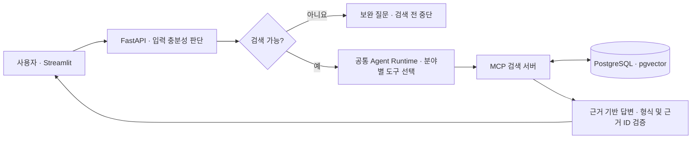

# LawPath

**생활 속 법률 문제를 AI Agent가 분석하고 관련 근거를 찾아주는 서비스**

AI 오케스트레이션 1기 · 2차 프로젝트 · 2팀

일상적인 말로 상황을 입력하면 법령·판례·상담사례를 검색하고 이해하기 쉬운 설명을 제공합니다. 지원 분야는 **임대차·주거 / 근로·임금 / 소비자·중고거래**입니다.

> 법률 정보 탐색을 돕는 교육용 MVP입니다. 법률 자문이나 승소 가능성을 보장하지 않으며, 검색 점수는 법률적 정확도를 의미하지 않습니다.

## 팀원과 역할

| 팀원 | 담당 | 주요 책임 |
|---|---|---|
| 장상옥 | 팀장 · Frontend | 화면, API·SSE 연동, 결과·저장·이력 UI, 통합 조율 |
| 임다혁 | Backend | FastAPI, 입력 판단·Agent 실행, 답변 생성, 인증·저장 API |
| 오병훈 | MCP | 검색 도구, 검색 서비스·Repository, 결과 반환 |
| 박지혜 | DB/RAG | 스키마, 원문 수집·정제, 청크·임베딩, 데이터 저장·검색 기반 |

## 주요 기능

- 내 사례 분석: 입력 충분성 판단, 상황 요약, 근거 기반 답변과 추가 확인 질문
- 근거 탐색: 법령·판례·상담사례를 구분하고 접기·상세보기 및 검색 점수 표시
- SSE 진행 표시와 기존 실행 결과 복구
- 분석 이후 궁금한 법률 용어 대화
- 회원가입·로그인, 완료된 분석·대화 선택 저장, 이력 조회·삭제
- 분석 결과 PDF 내려받기
- FAQ 및 비회원 임시 이력: 일부 기능은 서버 설정·메모리 저장 방식에 의존

코드 구현과 배포 환경 검증은 구분합니다. 시험 보고서의 실패·미검증 항목도 함께 확인하세요.

## 시스템 아키텍처



- 소비자: `search_laws` → `search_consultations` → `search_cases` (각 `top_k=3`)
- 임대차·근로: `search_cases` → `search_legal_documents`
- 외부 API·PDF 등은 사전 수집에 사용하며 사용자 질문은 내부 DB에서 검색합니다.
- 입력 판단은 LLM, 검색 순서는 분야별 정책으로 제한합니다. LangGraph/StateGraph는 사용하지 않습니다.
- 응답 형식과 근거 ID 검증이 모든 법률적 사실의 정확성을 보장하지는 않습니다.
- 일반 서비스 저장은 Backend가 처리하며 Frontend는 MCP·DB에 직접 연결하지 않습니다.

## 대표 시나리오

| 분야 | 질문 |
|---|---|
| 임대차·주거 | 주택 임대차 계약이 끝났는데 임대인이 보증금을 돌려주지 않습니다. 어떤 법 조문을 확인해야 하나요? |
| 근로·임금 | 퇴직했는데 회사가 퇴직금을 지급하지 않습니다. 퇴직금 지급 기한과 관련 법 조문을 알려주세요. |
| 소비자·중고거래 | 신용카드 일시불 결제 후 할부로 전환했는데 물건이 배송되지 않았습니다. 카드사에 할부항변권을 행사할 수 있나요? |

첫 통합 목표는 소비자 질문의 법령·상담사례·판례 각 3건이 DB → MCP → Backend → Frontend까지 일치해서 전달되는 것입니다. 부족하면 실제 결과만 반환하며, 개수와 관련성은 별도로 평가합니다.

## 실행 준비

Python 3.12, Docker 또는 PostgreSQL 16 + pgvector, LLM·Embedding API 자격증명과 적재 데이터가 필요합니다.

```powershell
git clone https://github.com/encore-ai-campus/aio-01-p2-team2.git
cd aio-01-p2-team2
python -m venv .venv
.\.venv\Scripts\Activate.ps1
python -m pip install -r requirements-dev.txt
Copy-Item .env.example .env
```

설정 이름은 [루트 예시](.env.example), [Frontend](frontend/.env.example), [Backend](backend/.env.example), [MCP](legal_mcp/.env.example)를 확인하세요. 서비스별 환경 파일이 루트 설정을 덮어쓸 수 있습니다.

1. DB·Redis 비밀번호, 서비스 접속 정보, 실제 LLM·Embedding 설정을 입력합니다. 키를 Git에 올리지 않습니다.
2. 새 환경에서는 `docker compose up -d postgres redis`로 저장소를 준비합니다. 기존 컨테이너·볼륨은 임의 삭제하지 않습니다.
3. [DB 실행·적재 가이드](database/README.md)를 따라 문서와 임베딩을 준비합니다. 컨테이너 실행만으로 법률 자료가 적재되지는 않습니다. 신규 볼륨과 기존 DB의 마이그레이션 적용을 구분하세요.
4. 각각의 터미널에서 가상환경을 활성화하고 서비스를 실행합니다.

```powershell
# MCP: 실제 FastMCP 직접 실행 경로
$env:MCP_HOST = "127.0.0.1"
$env:MCP_PORT = "8013"
python -m legal_mcp.server

# Backend (별도 터미널)
python -m uvicorn backend.app.main:app --host 0.0.0.0 --port 8000

# Frontend (별도 터미널)
python -m streamlit run frontend/app.py --server.port 8501
```

Frontend의 `BACKEND_API_URL`을 Backend 주소로, Backend의 `LEGAL_MCP_URL`을 실제 MCP 주소와 `/mcp` 경로로 맞춥니다. 예시의 팀 PC 주소·Mock 기본값은 본인 환경의 API 모드와 실제 Provider로 변경하세요. 기존 `scripts/run_mcp.ps1`의 uvicorn 경로 대신 위 FastMCP 직접 실행을 사용합니다. 새 환경의 DB·LLM 포함 E2E는 제출 정리 시 재실행하지 않았습니다.

## 시험과 필수 산출물

```powershell
python -m pytest
```

CI는 Python 3.12에서 의존성을 설치하고 pytest를 실행합니다. 자동 테스트 통과가 실제 검색의 법률 정답률을 뜻하지는 않습니다.

- [에이전트 아키텍처 설계서](docs/에이전트%20아키텍처%20설계서.md)
- [에이전트 시험 결과 보고서](docs/에이전트%20시험%20결과%20보고서.md)
- [100건 평가 실행 안내](tests/LAWPATH_EVALUATION.md)
- [최종 계획](docs/최종%20plan.md)
- [서비스 소개·발표 자료](docs/readme.md)
- [회의·개발 기록](docs/회의내용)

기존 보고서는 정상 50 / 정보 부족 20 / 빈 결과 10 / 타임아웃 10 / 인증 실패 5 / 상충 지시 5로 구성됩니다. 실제 서버 실행과 로컬 오류 주입을 구분하며 실패·통신 오류·수동 검토가 남아 있습니다. 원본 로그는 보고서의 별도 경로를 확인해야 합니다. 자기성찰 적용 전후 수치는 미측정입니다.

## 현재 한계

- 자동 검색어 수정·재검색을 포함한 완전한 자기성찰 루프는 미구현입니다.
- 검색 관련성, PDF 추출 품질, 법령의 최신성은 별도 점검이 필요합니다.
- 회원 저장 경로와 별개로 FAQ·알림·실행 상태 등에는 메모리 저장 코드가 남아 있습니다.
- 비회원 임시 보관은 Redis 활성화·서버 설정에 따라 달라집니다.
- 테스트용 Mock과 레거시는 실제 운영 모드와 구분해야 합니다.
- 출처·식별 정보는 내부 검증용으로 유지하지만 별도 출처 URL 버튼은 화면·다운로드에서 제거된 구성입니다.
- 수집 자료의 이용·재배포 조건은 별도 확인 대상입니다. 저장소 전체에 재배포 라이선스를 임의 부여하지 않습니다.

## 저장소와 협업

- 제출 저장소: [encore-ai-campus/aio-01-p2-team2](https://github.com/encore-ai-campus/aio-01-p2-team2)
- 원본 개발 저장소·Issue·PR: [jasnok/aio-01-p2-team2](https://github.com/jasnok/aio-01-p2-team2)
- 원본 저장소는 유지하고 Git 이력을 보존합니다. 기존 Issue·PR은 원본에서 확인합니다.
- 최종 산출물은 `main`, 변경은 작업 브랜치에서 검토 후 반영합니다.
- 기관 규칙의 팀장 Maintain / 팀원 Write 권한과 AIO-01 Team 배정은 운영 담당자에게 확인합니다.
